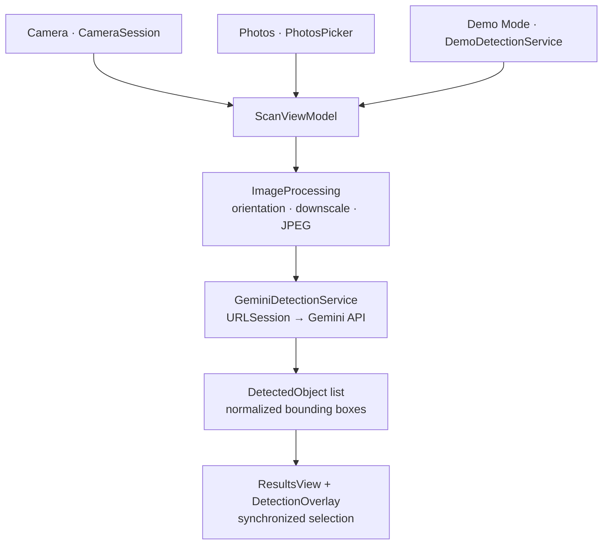

**Detect and identify multiple objects from a single photo.**

VisionBox is a small, focused SwiftUI app: point the camera at a scene (or pick
a photo), and Google's Gemini vision model detects the visible objects -
returning bounding boxes drawn over the image and a synchronized, tappable
result list. One image in, every recognizable object out.

Built as a portfolio demonstration of a complete camera → AI vision → adaptive
UI pipeline: SwiftUI, AVFoundation, Swift Concurrency, structured LLM output,
and a bring-your-own-key Gemini integration - with zero third-party
dependencies.

## Screenshots

<!--
SCREENSHOT TODO:
Add these files to docs/images/:
- scan-camera.png
- scan-photo-ready.png
- results-generic.png
- results-detailed.png
- results-selection.png
- results-list.png
- settings.png

After adding them, uncomment the screenshot gallery below.
-->

<table>
  <tr>
    <td align="center">
      <sub>Camera-first Scan</sub>
      <br /><br />
      
    </td>
    <td align="center">
      <sub>Photo Ready</sub>
      <br /><br />
      
    </td>
  </tr>
  <tr>
    <td align="center">
      <sub>Generic Results</sub>
      <br /><br />
      
    </td>
    <td align="center">
      <sub>Detailed Results</sub>
      <br /><br />
      
    </td>
  </tr>
  <tr>
    <td align="center">
      <sub>Result List</sub>
      <br /><br />
      
    </td>
    <td align="center">
      <sub>BYOK Settings</sub>
      <br /><br />
      
    </td>
  </tr>
</table>

## What VisionBox Does

Camera / Photos / Demo Mode → Gemini vision → structured detections →
normalized bounding boxes → synchronized Results UI.

- **Camera-first scanning** - the home screen is a live camera view with a
  shutter; capture goes straight into analysis.
- **Multiple objects from one image** - a single request returns every
  detected object with a label and a bounding box.
- **Generic and Detailed detection** - choose concise object names or
  evidence-based brand/model identification, right on the Scan screen.
- **Bounding boxes + synchronized selection** - tap a box to highlight its
  row, tap a row to highlight its box; boxes stay aligned at any size.
- **Photos support** - analyze any image from your library instead of the
  camera.
- **Demo Mode** - the full experience with bundled scenes, no key or network.
- **BYOK** - you supply your own Gemini API key; it's stored in the Keychain
  and never leaves the device except to authenticate with Google.
- **Resilient networking** - transient Gemini failures retry automatically
  with bounded backoff; a clear Try Again path covers the rest.

## Demo Mode

You can evaluate the entire UI **without a Gemini API key, network access, or
a physical camera**. Tap the ✨ button on the Scan screen (it introduces
itself on launch), pick one of the bundled scenes, and VisionBox runs the full
analyze → boxes → synchronized results flow against deterministic local
fixtures. Demo Mode never calls Gemini.

## Generic vs Detailed

A segmented control on the Scan screen picks the identification style for the
next analysis:

- **Generic** - concise, general object names ("game controller", "wrist
  watch").
- **Detailed** - attempts brand, product line, model, edition, color, or
  variant when those details are reliably visible in the image. The prompt
  explicitly instructs the model never to invent details the image doesn't
  support - when uncertain, it falls back to the more general name.

## Architecture

Deliberately small: SwiftUI views, one view model, and a service protocol with
two implementations. No repositories, coordinators, DI frameworks, or
third-party dependencies.



Key pieces:

- **`ScanView` / `ScanViewModel`** - the camera-first home screen and a single
  state machine (idle → photo ready → analyzing → results/error) driving
  every acquisition path.
- **`CameraSession` / `CameraPreview`** - a minimal AVFoundation stack:
  observable session lifecycle on a serial queue, `AVCaptureVideoPreviewLayer`
  preview, async still capture.
- **`ObjectDetectionService`** - one protocol; `GeminiDetectionService` (live)
  and `DemoDetectionService` (bundled fixtures) are interchangeable.
- **`GeminiDetectionService`** - direct `URLSession` calls to the Gemini API
  with structured JSON output, response validation, bounding-box
  normalization/clamping, and bounded retry with `Retry-After` support.
- **`ImageProcessing` / `ImageGeometry`** - EXIF orientation normalization,
  upload downscaling, and pure normalized-rect math shared by overlay
  rendering and hit testing.
- **`GeminiKeyStore` / `KeychainService`** - observable key availability
  backed by the iOS Keychain.
- **`DetectionSettings` / `OnboardingHints`** - small observable
  UserDefaults-backed stores for the Generic/Detailed preference and one-time
  hints.

## Gemini Setup (Bring Your Own Key)

VisionBox does not ship with an API key. Live detection talks **directly to
Google's Gemini API** from the device - there is no VisionBox backend.

1. Get a free Gemini API key from [Google AI Studio](https://aistudio.google.com/apikey).
2. Launch VisionBox and open **Settings** (gear, top right).
3. Paste the key and tap **Save & Test** - VisionBox validates it against the
   Gemini API.
4. The key is stored in the iOS Keychain (this-device-only). You can **Test
   Connection**, **Edit**, or **Remove** it any time.
5. Return to Scan and capture or choose a photo.

Never commit an API key to a repository - VisionBox keeps it out of source,
logs, and URLs by design (it's sent only in the request header to Google).

## Privacy

- The Gemini API key is stored in the iOS Keychain
  (`WhenUnlockedThisDeviceOnly`) - never in UserDefaults, files, or logs.
- Captured and selected images are transient: analyzed in memory, never saved
  to Photos or disk by the app.
- Image data leaves the device only when you run a live analysis, and goes
  directly to Google's Gemini API (with storage of the interaction disabled in
  the request).
- Demo Mode performs no network requests.
- No analytics, tracking, or third-party SDKs.

## Technology

- Swift & SwiftUI
- Swift Concurrency (async/await, actors)
- AVFoundation (camera capture)
- PhotosUI (`PhotosPicker`)
- Keychain Services
- Google Gemini API (structured JSON output)
- Swift Testing

## Requirements

- Xcode 27 (or newer)
- iOS 27.0+
- Live camera scanning needs a physical device; in the Simulator, Photos and
  Demo Mode provide the full experience.
- A Gemini API key for live detection (Demo Mode needs none).

## Running the Project

```bash
git clone <repository-url>
cd VisionBox
open VisionBox.xcodeproj
```

Select the VisionBox scheme and run. No dependency installation - there are no
third-party packages.

## Testing

A Swift Testing unit suite (145 tests) covers the view model state machine,
bounding-box math and hit testing, image processing, Gemini request/response
handling, retry/backoff behavior, Keychain-backed key storage, and the demo
fixtures. Networking is tested against a stubbed `URLProtocol` - no live calls.

Run with **Product → Test** in Xcode. There is no UI-test coverage; the suite
is unit tests only.

## Limitations & Scope

- Identification quality depends on what's visibly recognizable. Detailed
  mode only names brands/models it can support with visual evidence.
- Overlapping or ambiguous objects can affect detection and box placement.
- This is a portfolio/demo app, not production computer vision: no result
  persistence, history, or export.
