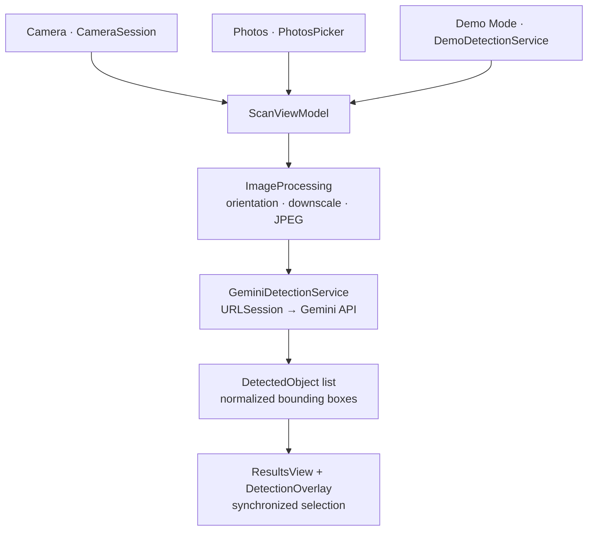

# VisionBox

**Detect and identify multiple objects from a single photo.**

VisionBox is a focused SwiftUI app for detecting objects in images. Point the
camera at a scene or choose a photo, and Google's Gemini vision model identifies
visible objects, draws bounding boxes over the image, and presents a
synchronized, interactive result list.

It uses a native iOS camera and UI stack, direct Gemini integration with
structured output, and a bring-your-own-key approach with no third-party
dependencies.

## Screenshots

<table>
  <tr>
    <td align="center">
      <sub>Camera-first Scan</sub>
      <br /><br />
      
    </td>
    <td align="center">
      <sub>Photo Ready</sub>
      <br /><br />
      
    </td>
  </tr>
  <tr>
    <td align="center">
      <sub>Generic Results</sub>
      <br /><br />
      
    </td>
    <td align="center">
      <sub>Detailed Results</sub>
      <br /><br />
      
    </td>
  </tr>
  <tr>
    <td align="center">
      <sub>Result List</sub>
      <br /><br />
      
    </td>
    <td align="center">
      <sub>BYOK Settings</sub>
      <br /><br />
      
    </td>
  </tr>
</table>

## Video Demo

<table>
  <tr>
    <td align="center">
      <sub>VisionBox in Action</sub>
    </td>
  </tr>
</table>

https://github.com/user-attachments/assets/92c84e4f-5bd8-4f9e-a566-a6981332616a
## Features

- **Camera-first scanning** — capture a scene and send it directly for analysis.
- **Multi-object detection** — identify multiple visible objects from a single
  image with a label and bounding box for each detection.
- **Generic and Detailed detection** — choose between concise object names and
  more specific identification when visual evidence supports it.
- **Interactive bounding boxes** — selecting a detection in the image highlights
  its result, and selecting a result highlights its bounding box.
- **Photos support** — analyze an existing image using the system Photos picker.
- **Demo Mode** — explore the complete detection and results experience without
  an API key, network connection, or physical camera.
- **Bring your own key** — configure a Gemini API key stored securely in the
  iOS Keychain.
- **Resilient networking** — transient Gemini failures use bounded automatic
  retries, with a manual Try Again path for recoverable failures.

## Demo Mode

Demo Mode lets you explore VisionBox without configuring Gemini or using a
physical camera.

Tap the ✨ button on the Scan screen and choose one of the bundled scenes.
VisionBox runs the same detection-results flow using deterministic local
fixtures, including bounding boxes and synchronized selection.

Demo Mode makes no network requests.

## Generic vs Detailed

The Scan screen provides two identification modes:

- **Generic** — returns concise, general object names such as
  `Game Controller` or `Wrist Watch`.
- **Detailed** — attempts to identify visible brand, product line, model,
  edition, color, or variant information when the image provides enough
  evidence.

Detailed mode is instructed not to invent unsupported details. When specific
identification is uncertain, it falls back to a more general name.

## Architecture

VisionBox intentionally uses a small architecture:

**SwiftUI → ViewModel → ObjectDetectionService → Gemini**



### Key Components

- **`ScanView` / `ScanViewModel`** — drives image acquisition, analysis state,
  errors, and results.
- **`CameraSession` / `CameraPreview`** — provides the AVFoundation camera
  session, live preview, and still-image capture.
- **`ObjectDetectionService`** — shared interface implemented by the live
  Gemini service and local Demo Mode service.
- **`GeminiDetectionService`** — communicates directly with Gemini using
  `URLSession`, structured responses, validation, and bounded retry behavior.
- **`ImageProcessing` / `ImageGeometry`** — handles image orientation,
  downscaling, normalized geometry, overlay rendering, and hit testing.
- **`GeminiKeyStore` / `KeychainService`** — stores and exposes Gemini API-key
  availability using the iOS Keychain.
- **`DetectionSettings`** — persists the Generic/Detailed detection preference.

The project uses no third-party dependencies or additional architectural
frameworks.

## Gemini Setup

VisionBox does not include an API key. Live detection communicates directly
with Google's Gemini API from the device.

1. Get a Gemini API key from [Google AI Studio](https://aistudio.google.com/apikey).
2. Launch VisionBox and open **Settings**.
3. Enter the key and tap **Save & Test**.
4. Return to Scan and capture or choose a photo.

The key is stored using the iOS Keychain with
`WhenUnlockedThisDeviceOnly` accessibility. Settings also lets you test the
connection, edit the key, or remove it.

Never commit API keys to source control.

## Privacy

- Gemini API keys are stored in the iOS Keychain, not UserDefaults or files.
- Captured and selected images are processed transiently and are not saved to
  Photos or persisted by VisionBox.
- Images are sent to Google's Gemini API only when performing live analysis.
- Demo Mode makes no network requests.
- VisionBox contains no analytics, tracking, or third-party SDKs.

## Technology

- Swift
- SwiftUI
- Swift Concurrency (`async`/`await`)
- AVFoundation
- PhotosUI (`PhotosPicker`)
- Keychain Services
- URLSession
- Google Gemini API
- Swift Testing

## Requirements

- Xcode 27 or newer
- iOS 27.0+
- Physical iPhone for live camera capture
- Gemini API key for live detection

Photos and Demo Mode can be used in the Simulator without a physical camera or
Gemini API key.

## Running VisionBox

```bash
git clone <repository-url>
cd VisionBox
open VisionBox.xcodeproj
```

Select the **VisionBox** scheme and run the project.

There are no external packages or dependency-installation steps.

## Testing

VisionBox includes unit tests covering:

- Scan state and analysis flow
- Bounding-box geometry and hit testing
- Image processing
- Gemini request and response handling
- Retry and recovery behavior
- Keychain-backed credential storage
- Demo Mode fixtures

Networking tests use a stubbed `URLProtocol` and do not make live Gemini
requests.

Run the suite with **Product → Test** in Xcode.

## Scope

VisionBox is intentionally focused on image acquisition, object detection, and
interactive results.

It does not include inventory management, saved scans, result history, cloud
sync, accounts, or export.

Detection accuracy depends on the contents and quality of the source image.
Occluded, overlapping, or visually ambiguous objects may affect identification
and bounding-box placement.
